# SDN DoS Detection & Mitigation con Mininet e Ryu

Simulazione di una rete Software Defined Networking (SDN) con **Mininet** e controller **Ryu**, estesa con un sistema di monitoraggio in grado di rilevare e bloccare automaticamente attacchi Denial of Service (DoS) di tipo UDP flooding.

## Struttura del progetto

```
.
├── topology.py              # Definizione della topologia di rete
├── controller.py            # Controller base (MAC learning switch, SimpleSwitch13)
├── controller_extended.py   # Controller esteso con monitoraggio e blocco DoS (SimpleMonitor13)
├── docs/
│   └── images/              # screenshot e grafici richiamati in questo README
└── README.md
```

## Indice

- [Panoramica](#panoramica)
- [Topologia di rete](#topologia-di-rete)
- [Controller base](#controller-base)
- [Requisiti](#requisiti)
- [Avvio della rete](#avvio-della-rete)
- [Generazione del traffico e simulazione dell'attacco](#generazione-del-traffico-e-simulazione-dellattacco)
  - [Traffico standard](#traffico-standard-e-valutazione-performance)
  - [Attacco DoS](#generazione-attacco-dos-e-valutazione-performance)
- [Sistema di monitoraggio e blocco dell'attacco](#sistema-di-monitoraggio-e-blocco-dellattacco)
- [Valutazione delle performance con mitigazione attiva](#valutazione-performance-con-sistema-di-monitoraggio-e-blocco)
- [Struttura del progetto](#struttura-del-progetto)
- [Note conclusive](#note-conclusive)

## Panoramica

L'obiettivo del progetto è simulare una rete SDN tramite l'emulatore **Mininet** e il controller **Ryu**, implementando un sistema di monitoraggio in grado di rilevare e bloccare in tempo reale un attacco DoS proveniente da uno degli host della topologia.

In una SDN l'intelligenza della rete viene spostata nel piano di controllo (control plane), reso programmabile via software. Il controller comunica con gli switch tramite il protocollo **OpenFlow**, adottato sia dagli switch software **OpenvSwitch** sia dal controller **Ryu**.

## Topologia di rete

La topologia (`topology.py`) è composta da:

- **3 host** (client `h1`, `h2` e server `h3`)
- **4 OpenvSwitch**
- **1 controller Ryu** di tipo `RemoteController`

Il controller viene istanziato come `RemoteController` e va quindi avviato da riga di comando **prima** di lanciare lo script della topologia, in modo da risultare già disponibile. Gli switch sono di tipo `OVSKernelSwitch`.

La banda dei link è differenziata in base al carico atteso:

| Link                        | Banda     |
| --------------------------- | --------- |
| Client (h1/h2) → Switch     | 10 Mbit/s |
| Backbone tra switch (s3–s4) | 12 Mbit/s |
| Switch → Server (h3)        | 12 Mbit/s |

Una volta costruita la rete (`build()`, `start()`), viene eseguito un `pingAll()` per testare la connettività tra tutti gli host tramite pacchetti ICMP, popolando così le forwarding table di ogni switch.

Per ispezionare le regole di flusso configurate su ciascuno switch:

```bash
sudo ovs-ofctl dump-flows <switch>
```

Per la visualizzazione grafica della topologia sono stati utilizzati:

- **Narmox Spear**, basato sull'output dei comandi `dump` e `links`
- **MiniEdit**, il tool grafico nativo di Mininet

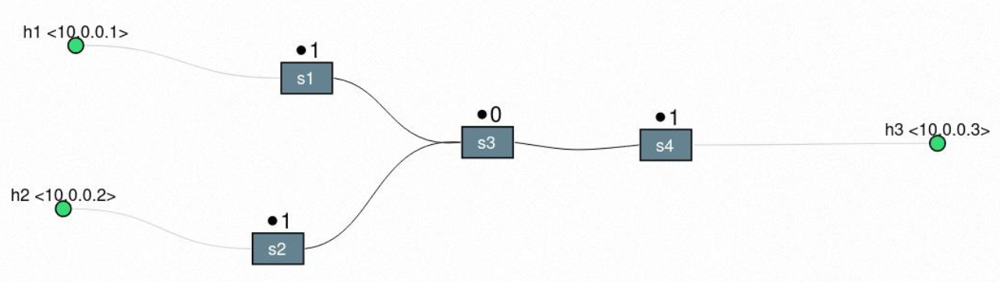

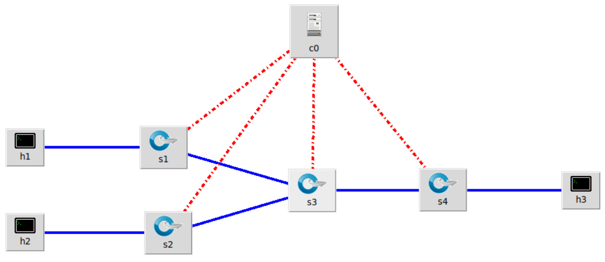

## Controller base

Il controller base (`controller.py`) implementa un semplice apprendimento dei MAC address (_MAC learning switch_):

- Il costruttore istanzia la MAC address table `mac_to_port`, usata per associare porte e indirizzi MAC.
- All'evento `EventOFPSwitchFeatures` (completato l'handshake switch-controller) viene installata la **table-miss flow entry** con priorità 0: ogni pacchetto privo di regola viene inoltrato al controller.
- All'evento `EventOFPPacketIn` (pacchetto con destinazione sconosciuta) il controller:
  1. estrae dal pacchetto datapath ID, MAC sorgente/destinazione e porta d'ingresso;
  2. memorizza la corrispondenza MAC sorgente → porta d'ingresso;
  3. se la destinazione è nota, inoltra sulla porta corretta e installa una regola con priorità 1; altrimenti esegue il flooding su tutte le porte.
- La funzione `add_flow` si occupa dell'inserimento di una nuova regola nella forwarding table dello switch, ricevendo datapath, priorità, criteri di matching e azioni da eseguire.

## Requisiti

- [Mininet](http://mininet.org/)
- [Ryu Controller](https://ryu-sdn.org/)
- OpenvSwitch
- [iperf](https://iperf.fr/)
- [D-ITG](http://www.grid.unina.it/software/ITG/) (Distributed Internet Traffic Generator)
- mathplotlib/pandas (per la generazione dei grafici)

## Avvio della rete

Avviare il controller Ryu:

```bash
ryu-manager controller.py
```

> Per avviare invece il controller **esteso** con monitoraggio e blocco DoS (§ [Sistema di monitoraggio e blocco dell'attacco](#sistema-di-monitoraggio-e-blocco-dellattacco)), usare `ryu-manager controller_extended.py` al posto di `controller.py`.

In un secondo terminale, avviare la topologia:

```bash
sudo python3 topology.py
```

Lo script esegue automaticamente il `pingAll()` tra tutti gli host, popolando le forwarding table di ogni switch.

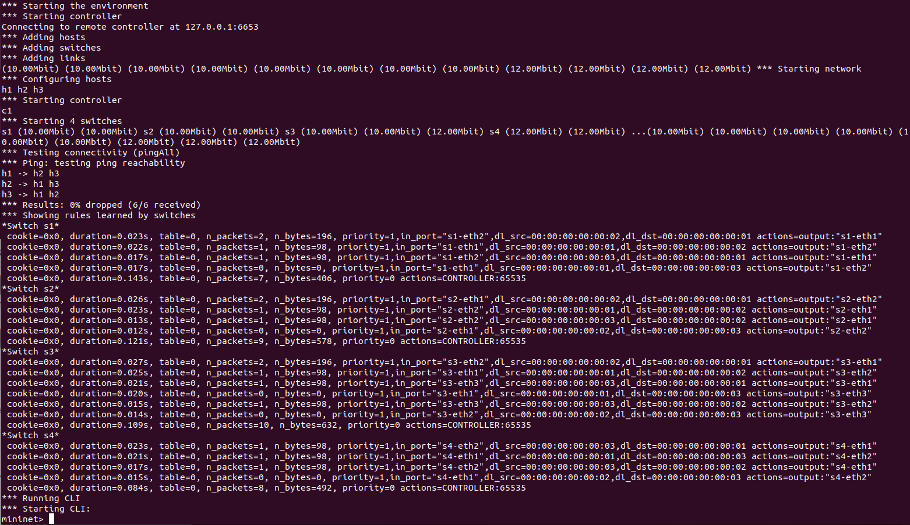

## Generazione del traffico e simulazione dell'attacco

Con il comando `xterm` si aprono i terminali degli host coinvolti: due finestre per `h3` (server) e una per `h1` e `h2` (client).

- `h1` genera traffico **UDP** verso `h3`
- `h2` genera traffico **TCP** verso `h3`

Entrambi i flussi sono dimensionati per un throughput di 5 Mbit/s, coerente con la banda dei link (10/12 Mbit/s), come verificato tramite `iperf`.

### Traffico standard e valutazione performance

Si avviano i server `iperf`:

```bash
# Su h3 — server TCP sulla porta 5001
iperf -s -i 1 |tee throughput2_normal.txt

# Su h3 — server UDP sulla porta 5003
iperf -s -u -p 5003 -i 1 |tee throughput1_normal.txt
```

e i rispettivi client su `h1` e `h2`, verso l'IP di `h3` (`10.0.0.3`), riservando 5 Mbit/s per flusso. I valori di throughput sono registrati con cadenza di 1 secondo e successivamente rappresentati tramite `mathplotlib`.

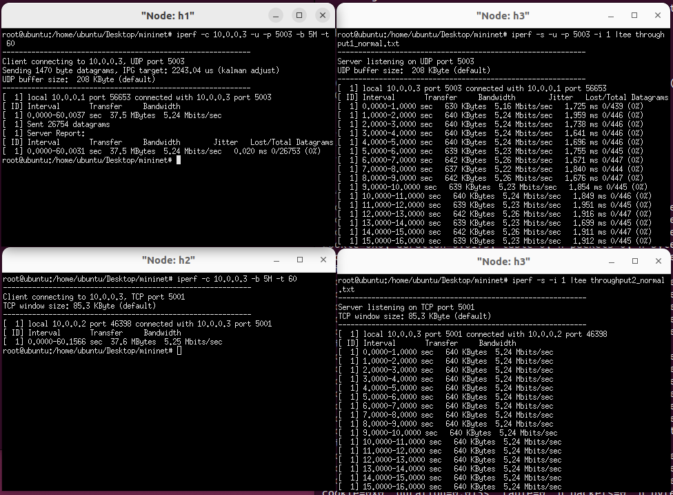

**Risultato:** entrambi i throughput restano stabili intorno a 5 Mbit/s, senza degradazione delle performance.

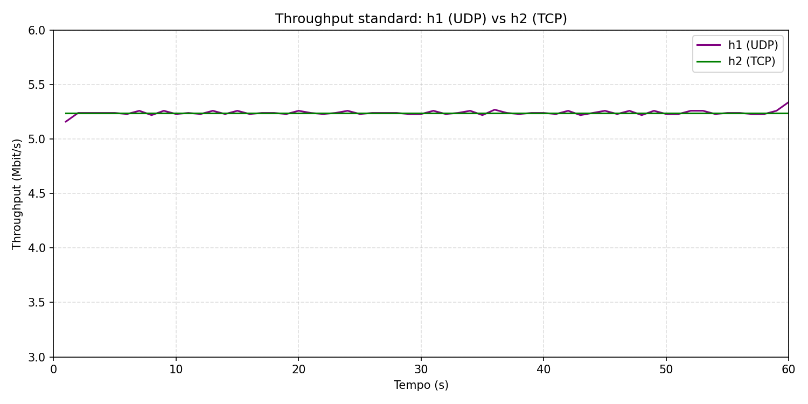

### Generazione attacco DoS e valutazione performance

Per simulare un attacco **DoS UDP flooding** da parte di `h1`, si modifica il comando `iperf` lanciato da `h1`, generando un flusso di 10 Mbit/s su 6 connessioni parallele verso `h3`:

```bash
iperf -c 10.0.0.3 -u -b 10M -P 6
```

**Risultato:** il throughput TCP tra `h2` e `h3` degrada notevolmente, poiché il traffico generato da `h1` congestiona la rete rendendo il server difficilmente raggiungibile per gli utenti legittimi.

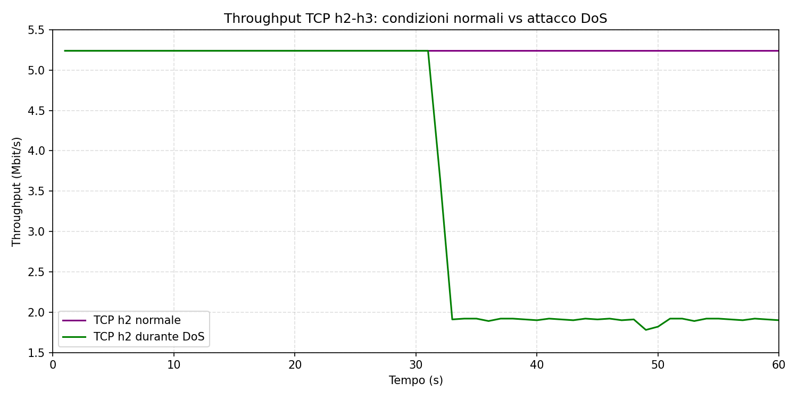

Oltre al throughput, sono state valutate le metriche QoS di **delay** e **jitter** tramite D-ITG, (Distributed Internet Traffic Generator), una piattaforma
capace di generare traffico IPv4 e al contempo è un tool capace di misurare le più comuni metriche di performance della
rete a livello pacchetto.
Si analizza uno scenario di traffico normale, tramite i seguenti comandi:

```bash
# Su h3 — avvio ricevitore e logger
ITGRecv
ITGLog

# Traffico inviato da h1 (UDP, default)
ITGSend -a 10.0.0.3 -C 1000 -c 625 -t 60000 -x recv1
# Traffico inviato da h2 (TCP)
ITGSend -a 10.0.0.3 -T TCP -C 1000 -c 625 -t 60000 -x recv2
```

Coerentemente con quanto avviene con iperf, il throughput medio è pari all’incirca a 5 Mbit/s, inoltre si vede come i valori di delay e di jitter
siano notevolmente bassi.

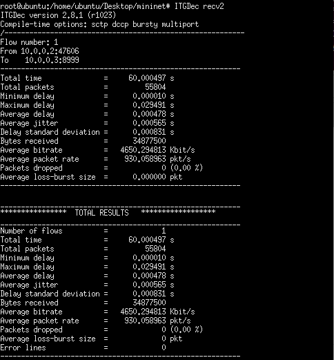

Sotto attacco invece, l'host h1 genera 6 flussi paralleli, tutti
con le stesse caratteristiche, mediante l'uso di uno script che viene poi lanciato con il comando ITGSend.

```bash
# Su h3 — avvio ricevitore e logger
ITGRecv
ITGLog

# Traffico inviato da h1 (UDP, default)
ITGSend script_file
# Traffico inviato da h2 (TCP)
ITGSend -a 10.0.0.3 -T TCP -C 1000 -c 625 -t 60000 -x attack2

# Contenuto script_file
-a 10.0.0.3 -rp 10001 -C 10000000 -c 100000 -T UDP -t 60000
-a 10.0.0.3 -rp 10002 -C 10000000 -c 100000 -T UDP -t 60000
-a 10.0.0.3 -rp 10003 -C 10000000 -c 100000 -T UDP -t 60000
-a 10.0.0.3 -rp 10004 -C 10000000 -c 100000 -T UDP -t 60000
-a 10.0.0.3 -rp 10005 -C 10000000 -c 100000 -T UDP -t 60000
-a 10.0.0.3 -rp 10006 -C 10000000 -c 100000 -T UDP -t 60000

```

Dai risultati si può notare subito come il throughput medio si sia abbassato e i valori di delay e jitter siano invece aumentati.

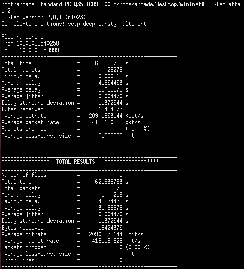

I file di log per graficare delay e jitter sono stati realizzati con `ITGDec`:

```bash
ITGDec <logfile> -d 1000  <logname.txt> # delay per secondo
ITGDec <logfile> -j 1000  <logname.txt> # jitter per secondo
```

**Risultato:** senza attacco, delay e jitter restano prossimi allo zero; durante l'attacco DoS il delay raggiunge picchi di circa 4 secondi, con un lieve peggioramento del jitter.

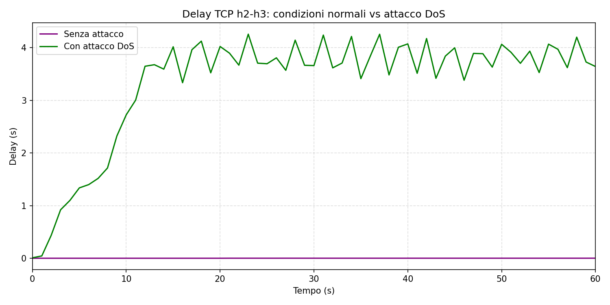

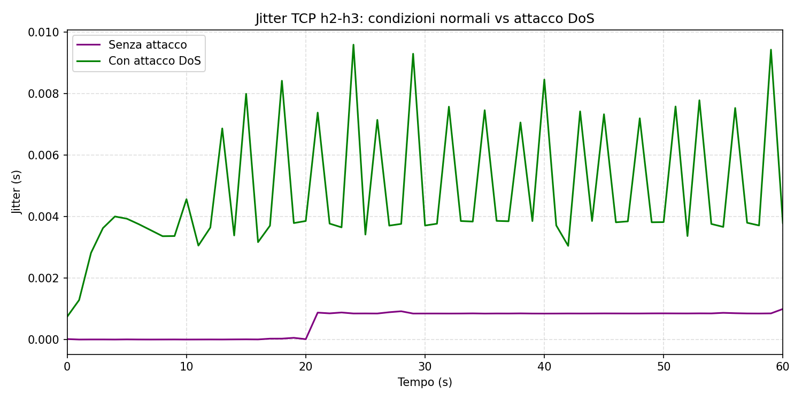

## Sistema di monitoraggio e blocco dell'attacco

Il controller base viene esteso (`controller_extended.py`) con la classe `SimpleMonitor13`, che eredita da `SimpleSwitch13` e aggiunge un thread di monitoraggio periodico (`_monitor`, ogni **10 secondi**, `self.time_monitor`).

**Componenti principali:**

- `EventOFPStateChange`: mantiene aggiornata la lista degli switch connessi (aggiunta in `MAIN_DISPATCHER`, rimozione in `DEAD_DISPATCHER`).
- `_request_stats`: invia a ogni switch `OFPFlowsStatsRequest` e `OFPPortStatsRequest`.
- `_port_stats_reply`: gestisce la risposta `EventOFPPortStatsReply`; calcola il throughput per porta a partire dalla differenza di `rx_bytes` tra due rilevazioni consecutive, diviso l'intervallo di monitoraggio, e contiene la logica di blocco dell'attacco.

**Soglie di throughput configurate:**

| Switch | Soglia                      | Motivazione                                                    |
| ------ | --------------------------- | -------------------------------------------------------------- |
| s1, s2 | 6 Mb/s (750.000 byte/s)     | Convogliano il traffico di un solo host client (5 Mb/s attesi) |
| s3, s4 | 8,6 Mb/s (1.075.000 byte/s) | Superata solo se uno dei client eccede la banda riservata      |

**Logica di blocco (`_block_attack` / `_port_stats_reply_handler`):**

1. Ad ogni ciclo di polling (ogni 10s), per ciascuna porta si calcola il throughput come differenza tra i `rx_bytes` correnti e quelli del ciclo precedente, diviso l'intervallo di monitoraggio.
2. Se la porta **non ha ancora un timer attivo** (nessun blocco in corso su di essa) e il sistema non è già in stato di blocco globale (`self.block is False`):
   - se il throughput supera la soglia dello switch, viene installata **immediatamente** una regola di **drop** con priorità 2 (superiore alla priorità 1 delle regole base) sulla porta d'ingresso interessata (`_block_attack`), la porta viene aggiunta al dizionario `blocked_list`, e le viene associato un timer di 10 secondi.
3. Ad ogni ciclo di polling successivo, per una porta con timer attivo, il valore residuo viene decrementato di 10 e salvato (`give_value`), finché non arriva a zero:
   - se il throughput è tornato sotto soglia → la porta **non** era (o non è più) la sorgente dell'attacco: la regola di drop viene rimossa subito (`remove_table_flow`) e il suo timer eliminato;
   - se il throughput è ancora sopra soglia → la porta viene **confermata** come sorgente dell'attacco: si imposta lo stato globale `self.block = True` e il suo timer viene esteso a 90 secondi.
4. Il controllo del punto 3 vale sia per il primo timer da 10s sia per quello esteso da 90s: allo scadere dei 90s la porta confermata viene **ricontrollata allo stesso modo**, se il traffico è rientrato sotto soglia viene sbloccata, altrimenti il blocco viene rinnovato per altri 90s. In questo modo l'host attaccante resta isolato per tutta la durata reale dell'attacco e viene riabilitato automaticamente non appena il suo traffico torna nella norma, senza bisogno di intervento manuale o riavvio del controller.
5. Ogni porta viene valutata esclusivamente sul proprio throughput: la conferma di una porta non ha effetto sulle altre porte eventualmente bloccate in via cautelativa su switch diversi, che si liberano autonomamente al proprio ciclo di ricontrollo non appena il traffico a monte viene effettivamente bloccato.
6. Quando `self.block` diventa `True`, il thread `_monitor`, al termine del ciclo di polling in corso, resetta `prev_rx_bytes_dict` e mette in pausa le richieste di statistiche per **50 secondi**, per dare il tempo alla rete di smaltire i pacchetti accumulati durante il blocco.

Questo approccio a due fasi (blocco cautelativo di ogni porta sopra soglia con controllo dopo 10s unito al rilascio autonomo dei "falsi sospetti" e alla riabilitazione automatica della sorgente attaccante solo dopo che questa sia  rientrata sotto soglia) permette di **isolare solo l'host attaccante**, minimizzando l'impatto sugli utenti legittimi e senza richiedere alcun coordinamento esplicito tra switch diversi.

## Valutazione performance con sistema di monitoraggio e blocco

Ripetendo lo stesso scenario di traffico (§ [Generazione attacco DoS](#generazione-attacco-dos-e-valutazione-performance)) con il controller esteso attivo, si confronta il throughput TCP tra `h2` e `h3`:

- **Senza mitigazione:** il throughput è inizialmente intorno al valore nominale di 5 Mb/s per poi crollare a 2 Mb/s per tutta la durata dell'attacco.

- **Con mitigazione attiva:** dopo ~10s dall'inizio dell'attacco, il throughput crolla brevemente a 2 Mb/s (10s di blocco per l'identificazione della sorgente), poi oscilla temporaneamente tra 9 e 10 Mb/s (fase di recupero dei pacchetti accumulati), per poi ristabilizzarsi intorno ai 5 Mb/s previsti.

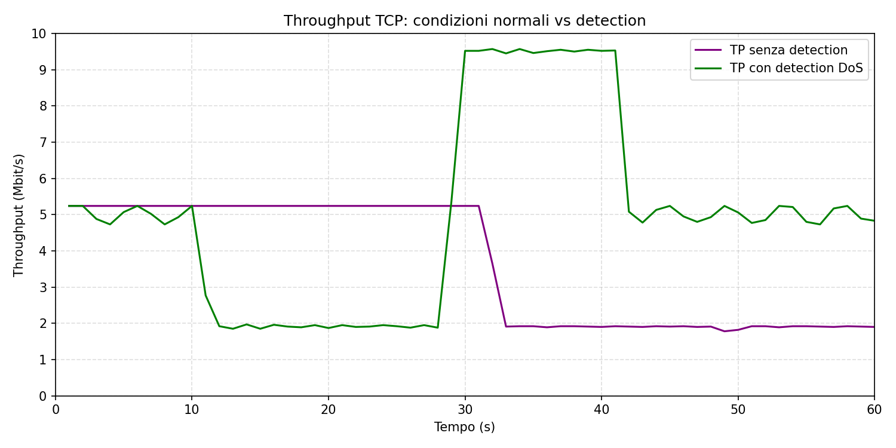

Le stesse considerazioni valgono per le metriche di delay e jitter, misurate nuovamente tramite D-ITG.

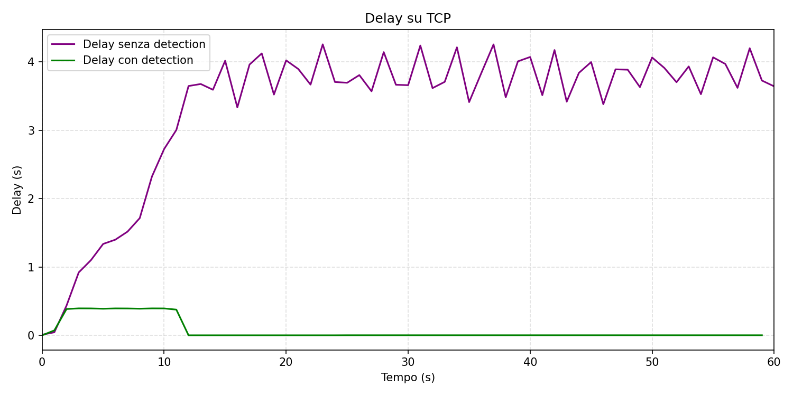

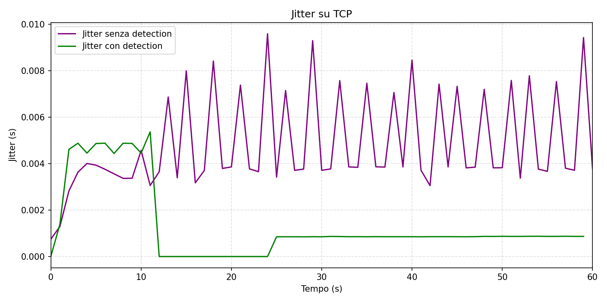

Al termine dei test, ispezionando le forwarding table degli switch, solo `s1` presenta la regola di drop sulla porta 1 (collegata all'host attaccante `h1`); le altre forwarding table risultano invariate.


## Note conclusive

Il sistema implementato tiene conto di due aspetti chiave:

1. **Isolamento progressivo della sorgente**: l'algoritmo blocca cautelativamente ogni porta che supera la soglia, ma la conferma come sorgente dell'attacco solo dopo 10 secondi di persistenza sopra soglia; al momento della conferma, le porte bloccate in via cautelativa che nel frattempo sono rientrate sotto soglia vengono liberate, isolando così unicamente il vero attaccante.
2. **Minimizzazione dell'impatto sugli utenti legittimi**: grazie al punto precedente, un utente legittimo il cui traffico avesse temporaneamente superato la soglia (es. per un picco naturale) viene sbloccato già al primo controllo dopo 10s, se il suo throughput è rientrato nella norma.
