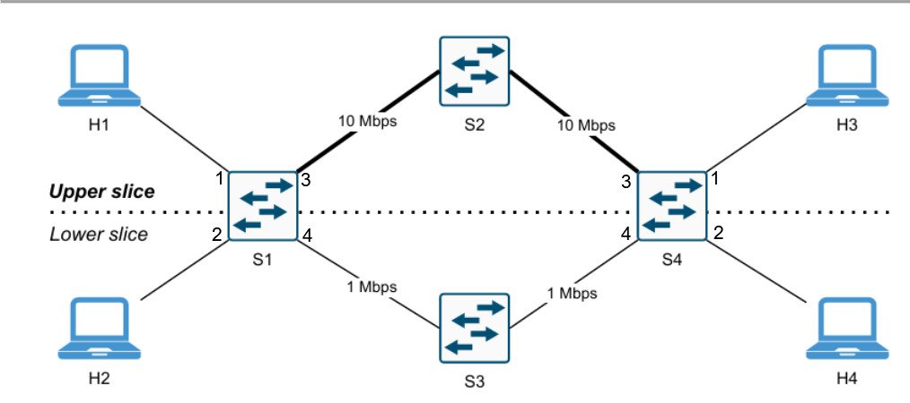

# Network Slicing in SDN con Mininet e Ryu

Project work per l'esame di **Network and Cloud Infrastructures**

Implementazione di **topology slicing** e **service slicing** in ambiente SDN,
con topologia emulata in Mininet e controller Ryu su OpenFlow 1.3.

## Contenuto del repository

```
.
├── topology.py              # topologia Mininet: 4 switch, 4 host, 2 percorsi
├── slicing_controller.py    # controller Ryu, due modalità operative
├── README.md
└── docs/
    ├── elaborato.pdf        # documento d'esame
    ├── topologia.png
    └── screenshots/         # output di tutti gli esperimenti
```

## La topologia



Due percorsi paralleli fra gli switch di accesso `s1` e `s4`: quello superiore
via `s2` a 10 Mbps e 2 ms, quello inferiore via `s3` a 1 Mbps e 5 ms.

| Host | IP | MAC | Switch di accesso |
|---|---|---|---|
| h1 | 10.0.0.1 | `00:00:00:00:00:01` | s1, porta 1 |
| h2 | 10.0.0.2 | `00:00:00:00:00:02` | s1, porta 2 |
| h3 | 10.0.0.3 | `00:00:00:00:00:03` | s4, porta 1 |
| h4 | 10.0.0.4 | `00:00:00:00:00:04` | s4, porta 2 |

Sugli switch di accesso **la porta 3 è lo slice upper, la porta 4 il lower**.

## Requisiti

**Ubuntu 22.04 LTS (Python 3.10)**, Mininet 2.3.0 con Open vSwitch, Ryu 4.34.

> Non usare Ubuntu 24.04: Python 3.12 ha rimosso `distutils` e Ryu non è
> installabile.

## Installazione

### 1. Pacchetti di sistema

```bash
sudo apt update
sudo apt install -y git python3-pip python3-venv build-essential iperf tcpdump
```

### 2. Mininet

```bash
git clone https://github.com/mininet/mininet
cd mininet && git checkout -b mininet-2.3.0 2.3.0 && cd ..
sudo PYTHON=python3 mininet/util/install.sh -nv
```

### 3. Ryu in virtualenv

L'ordine dei comandi è vincolante.

```bash
python3 -m venv ~/ryu-venv
source ~/ryu-venv/bin/activate
pip install --upgrade pip
pip install "setuptools==57.5.0" wheel pbr
pip install --no-build-isolation ryu==4.34
pip install "eventlet==0.33.3" "dnspython==2.2.1"
```

Ryu 4.34 importa da eventlet una costante rimossa nelle versioni recenti e senza
questa patch non si avvia:

```bash
sed -i 's/^\( *\)from eventlet\.wsgi import ALREADY_HANDLED/\1ALREADY_HANDLED = None/' \
    ~/ryu-venv/lib/python3.10/site-packages/ryu/app/wsgi.py
```

Verifica finale (atteso `ryu-manager 4.34`):

```bash
ryu-manager --version
```

## Esecuzione

Servono **due terminali**. Il virtualenv serve solo a Ryu; Mininet gira con
`sudo` e il Python di sistema. Avviare sempre prima Ryu, così gli switch trovano
il controller già in ascolto sulla porta 6653.

**Terminale 1 — controller**

```bash
source ~/ryu-venv/bin/activate

# modalità topology (default): isolamento fra slice
ryu-manager slicing_controller.py

# oppure modalità service: tutti comunicano, percorso scelto per servizio
SLICING_MODE=service ryu-manager slicing_controller.py
```

La prima riga di log conferma la modalità attiva.

**Terminale 2 — rete**

```bash
sudo mn -c
sudo python3 topology.py
```

Attendere il prompt `mininet>` prima di digitare. Per chiudere: `exit` nella
CLI, poi `sudo mn -c`.

## Riproduzione degli esperimenti

### Modalità topology

```
mininet> pingall                      # atteso: 66% dropped (4/12)
mininet> h1 arp -n                    # 10.0.0.3 risolto, gli altri (incomplete)
mininet> h1 ping -c5 h3               # RTT medio ~12 ms  (slice upper)
mininet> h2 ping -c5 h4               # RTT medio ~24 ms  (slice lower)
```

Throughput sui due slice:

```
mininet> h3 iperf -s -p 5001 &
mininet> h1 iperf -c 10.0.0.3 -p 5001 -t 10 -i 1      # ~9,55 Mbps
mininet> h3 pkill iperf
mininet> h4 iperf -s -p 5001 &
mininet> h2 iperf -c 10.0.0.4 -p 5001 -t 10 -i 1      # ~1,21 Mbps
```

Verifica del percorso fisico, da due terminali aggiuntivi:

```bash
sudo tcpdump -i s2-eth1 -n icmp -c 20     # solo h1 <-> h3
sudo tcpdump -i s3-eth1 -n icmp -c 20     # solo h2 <-> h4
```

```
mininet> h1 ping -c10 h3 &
mininet> h2 ping -c10 h4
```

### Modalità service

Riavviare Ryu con `SLICING_MODE=service`; Mininet non va riavviato, gli switch
si riconnettono da soli.

```
mininet> pingall                      # atteso: 0% dropped (12/12)
```

Stessa coppia di host e stesso bitrate, cambia solo la porta di destinazione:

```
mininet> h3 iperf -s -u -p 9999 &
mininet> h1 iperf -c 10.0.0.3 -u -p 9999 -b 20M -t 10 -i 1   # ~9,72 Mbps
mininet> h3 pkill iperf
mininet> h3 iperf -s -u -p 5001 &
mininet> h1 iperf -c 10.0.0.3 -u -p 5001 -b 20M -t 10 -i 1   # ~0,97 Mbps
```

Il dato rilevante è il **Server Report**, che riporta il rate ricevuto; i valori
del client indicano solo il rate di invio.

Ispezione della flow table durante i due flussi:

```bash
sudo ovs-ofctl dump-flows s1 -O OpenFlow13
```

Le due regole UDP hanno identici `in_port`, `dl_src` e `dl_dst`: cambia solo
`tp_dst` (9999 contro 5001), e con esso priorità (20 contro 10) e porta di
uscita (`s1-eth3` contro `s1-eth4`).

Gli screenshot di tutti gli esperimenti, compresi i test TCP e le verifiche di
configurazione, sono in `docs/screenshots/`.
