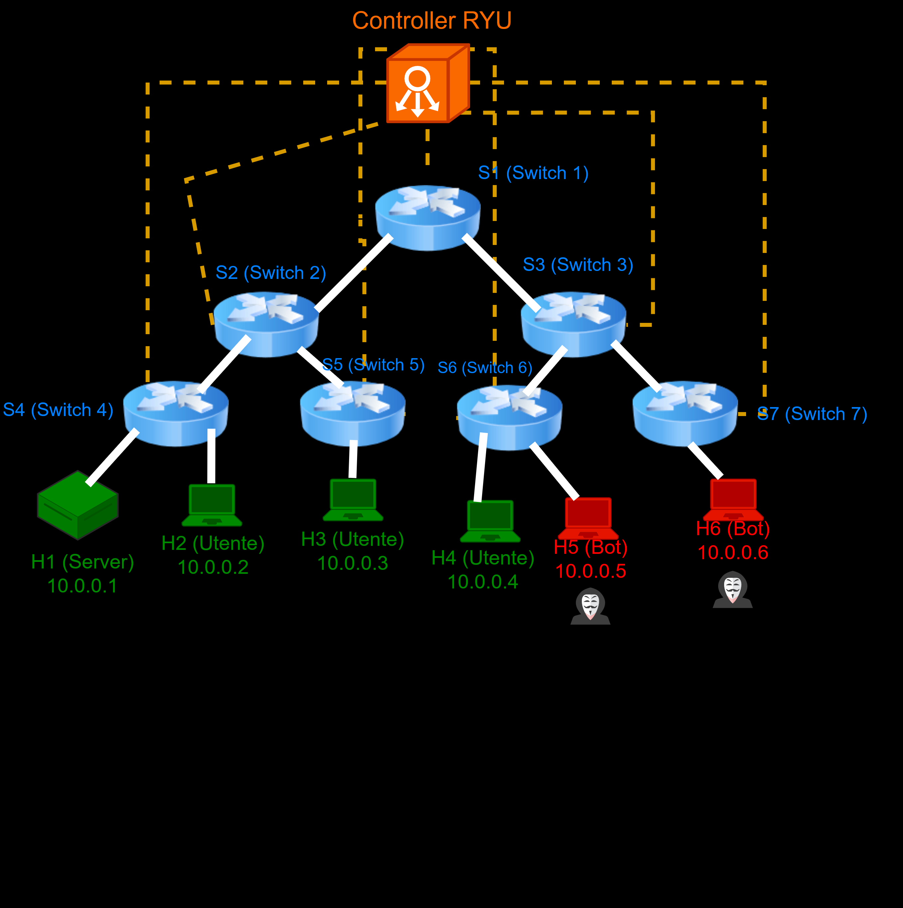

# NCIS: Stealth Botnet Mitigation via SDN & MIR

Questo progetto fornisce un'architettura Software-Defined Networking (SDN) modulare per rilevare e mitigare attacchi botnet *stealth* a livello applicativo (Layer 7). 

Sfruttando un controller **Ryu** e il protocollo **OpenFlow 1.3**, il sistema implementa un motore di Deep Packet Inspection (DPI) distribuito agli Edge della rete. Il traffico malevolo viene distinto da quello legittimo mediante il calcolo dinamico del **Message Innovation Rate (MIR)**, una metrica semantica che quantifica l'eterogeneità delle richieste HTTP in tempo reale, superando i limiti dei tradizionali sistemi di difesa volumetrici.

<p align="center">
  
  <br>
  <em>Rappresentazione logica dell'infrastruttura di test: struttura ad albero a 3 livelli con isolamento Edge per ispezione DPI mirata.</em>
</p>

## Requisiti di Sistema
Il progetto è stato sviluppato, collaudato ed elaborato su **OpenSUSE**, ma la sua architettura garantisce la piena compatibilità con le principali distribuzioni Linux.

**ATTENZIONE: Vincolo Python per Ryu**
A causa di un vincolo di dipendenze legacy legate al pacchetto `pbr` usato da Ryu che dipende da `distutils` (rimosso in Python 3.12) e di un supporto ufficiale che non si estende oltre Python 3.9, è necessario eseguire il controller con Python 3.9 o 3.10.
* **OS:** Linux (OpenSUSE, Ubuntu, Debian, ecc.)
* **Python:** Rigorosamente `3.10` (o `3.9`)
* [Mininet](http://mininet.org/)
* [Ryu SDN Framework](https://ryu-sdn.org/)
* Wireshark / Tshark (per l'analisi forense dei PCAP)


## Riproduzione dell'esperimento

**Ordine di avvio:** Il comando di pulizia `sudo mn -c` termina forzatamente i processi in ascolto sulle porte OpenFlow (incluso il controller Ryu). È fondamentale eseguirlo **prima** di avviare il controller.

### Step 0: Pulizia dell'ambiente
In un terminale, assicurarsi che non ci siano istanze appese di Mininet:
```bash
sudo mn -c
```

### Terminale 1: Avvio del Controller SDN

Avviare il controller Ryu che ospita i moduli Monitor, Analyzer ed Enforcer, inclusa la REST API (esposta sulla porta 8080):

```bash
ryu-manager ryu_firewall.py
```

### Terminale 2: Avvio Topologia e Traffico

In un nuovo terminale, lanciare la topologia ad albero custom:

```bash
sudo python3 topology.py
```

Appena compare il prompt interattivo di Mininet (`mininet>`), incollare il seguente blocco per avviare in parallelo il server, 3 utenti legittimi (100 URL procedurali) e 2 bot (3 URL fissi nell'Emulation Dictionary):

```bash
h1 python3 traffic_generator.py --role server > /tmp/h1.log 2>&1 &
h2 python3 traffic_generator.py --role user --target 10.0.0.1 > /tmp/h2.log 2>&1 &
h3 python3 traffic_generator.py --role user --target 10.0.0.1 > /tmp/h3.log 2>&1 &
h4 python3 traffic_generator.py --role user --target 10.0.0.1 > /tmp/h4.log 2>&1 &
h5 python3 traffic_generator.py --role bot  --target 10.0.0.1 > /tmp/h5.log 2>&1 &
h6 python3 traffic_generator.py --role bot  --target 10.0.0.1 > /tmp/h6.log 2>&1 &
```

Per terminare l'esperimento e innescare il salvataggio automatico del file PCAP, digitare `exit` nel prompt di Mininet.

### Terminale 3: Interazione REST API

Mentre la simulazione è in corso, è possibile interrogare dinamicamente il firewall.

> **Nota**: Da eseguire in un terminale normale della macchina host, non dal prompt mininet> né da un nodo.

1. **Visualizzare lo stato del firewall:**
Per ottenere la lista degli IP attualmente bloccati e il motivo della mitigazione:

```bash
curl -s http://127.0.0.1:8080/firewall/blocklist | python3 -m json.tool
```

2. **Aggiunta manuale:**
Per inserire proattivamente un IP nella blocklist simulando l'intervento di un IDS o di un operatore esterno:

```bash
curl -X POST -H "Content-Type: application/json" -d '{"ip": "10.0.0.5"}' http://127.0.0.1:8080/firewall/block
```

3. **Rimozione manuale:**
Per forzare lo sblocco di un host ignorando il decadimento naturale dell'hardware timeout di OpenFlow:

```bash
curl -X DELETE http://127.0.0.1:8080/firewall/block/10.0.0.5
```

## Analisi dei Dati

Al termine della simulazione, il sistema genera un file log `mir_metrics.jsonl`. Per renderizzare graficamente l'andamento del MIR, del throughput e della latenza, eseguire:

```bash
python3 graphs.py

```

## Struttura del Progetto

* `ryu_firewall.py`: Core del controller SDN (Monitor, Analyzer, Enforcer).
* `topology.py`: Script Mininet per la topologia ad albero e l'automazione dello sniffing.
* `traffic_generator.py`: Motore di generazione traffico HTTP per bot e utenti legittimi.
* `graphs.py`: Utility per il rendering delle metriche prestazionali.
* `mir_metrics.jsonl`: File di salvataggio delle metriche.
* `server_capture.pcap`: File trailer per l'analisi del traffico di rete mediante la cattura di pacchetti.
* `latency.png`: Grafico che indica la latenza media degli host in base alla finestra temporale.
* `mir_trend.png`: Grafico che mostra l'andamento di ogni singolo host in base alla finestra temporale.
* `throughput.png`: Grafico che mostra il throughput per host (RPS) in base alla finestra temporale.
* `server_capture.png`: Immagine che mostra l'analisi del traffico HTTP in Wireshark e la differenza tra utenza legittima e bot.